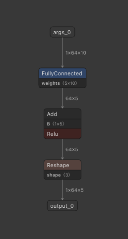

# ai-edge-torch-bugs-report
This repository is for reporting bugs related to AI Edge Torch.

## Bug1
### Description
When exporting a model that combines `nn.Linear` (with bias enabled) and `nn.ReLU`, we expect the converter to fuse them into a single `FullyConnected + ReLU` layer.
Instead, as shown in `bug2.tflite`, the export produces separate `FullyConnected` and `Bias + ReLU` layers.
Additionally, the `FullyConnected` layer’s output loses its batch dimension and becomes a 64 × 5 tensor, whereas the bias tensor remains 1 × 5. This mismatch triggers a broadcast operation that prevents GPU execution.

The issue is absent in AI Edge Torch v0.2.0 but appears from v0.4.0 onward. 
(v0.3.0 could not be tested because tf-nightly is no longer installable.)



### How to reproduce
```bash
uv sync
uv run bug1/bug1.py # create bug1.tflite
```

> [!NOTE]
> See bug1/bug1.py for full details.


## Bug2
Exporting `nn.LayerNorm` itself works correctly, but running the exported TFLite model yields different outputs on CPU and GPU.
For example, with `bug2.tflite` on a Google Pixel 6a, feeding an all-ones tensor of shape 1 × 4 × 4 × 4 produces inconsistent results between the two back ends.

```bash
✅ Output match at index 0: 0.7882136
✅ Output match at index 1: 1.1679684
✅ Output match at index 2: -1.2030246
✅ Output match at index 3: -0.7531573
❌ Output mismatch at index 4: GPU: 0, CPU: 0.78821355
❌ Output mismatch at index 5: GPU: 0, CPU: 1.1679683
❌ Output mismatch at index 6: GPU: 0, CPU: -1.2030246
❌ Output mismatch at index 7: GPU: 0, CPU: -0.75315726
❌ Output mismatch at index 8: GPU: 0, CPU: 0.78821355
❌ Output mismatch at index 9: GPU: 0, CPU: 1.1679683
❌ Output mismatch at index 10: GPU: 0, CPU: -1.2030246
❌ Output mismatch at index 11: GPU: 0, CPU: -0.75315726
❌ Output mismatch at index 12: GPU: 0, CPU: 0.78821355
❌ Output mismatch at index 13: GPU: 0, CPU: 1.1679683
❌ Output mismatch at index 14: GPU: 0, CPU: -1.2030246
❌ Output mismatch at index 15: GPU: 0, CPU: -0.75315726
❌ Output mismatch at index 16: GPU: 0, CPU: 0.78821355
❌ Output mismatch at index 17: GPU: 0, CPU: 1.1679683
❌ Output mismatch at index 18: GPU: 0, CPU: -1.2030246
❌ Output mismatch at index 19: GPU: 0, CPU: -0.75315726
❌ Output mismatch at index 20: GPU: 0, CPU: 0.78821355
❌ Output mismatch at index 21: GPU: 0, CPU: 1.1679683
❌ Output mismatch at index 22: GPU: 0, CPU: -1.2030246
❌ Output mismatch at index 23: GPU: 0, CPU: -0.75315726
❌ Output mismatch at index 24: GPU: 0, CPU: 0.78821355
❌ Output mismatch at index 25: GPU: 0, CPU: 1.1679683
❌ Output mismatch at index 26: GPU: 0, CPU: -1.2030246
❌ Output mismatch at index 27: GPU: 0, CPU: -0.75315726
❌ Output mismatch at index 28: GPU: 0, CPU: 0.78821355
❌ Output mismatch at index 29: GPU: 0, CPU: 1.1679683
❌ Output mismatch at index 30: GPU: 0, CPU: -1.2030246
❌ Output mismatch at index 31: GPU: 0, CPU: -0.75315726
❌ Output mismatch at index 32: GPU: 0, CPU: 0.78821355
❌ Output mismatch at index 33: GPU: 0, CPU: 1.1679683
❌ Output mismatch at index 34: GPU: 0, CPU: -1.2030246
❌ Output mismatch at index 35: GPU: 0, CPU: -0.75315726
❌ Output mismatch at index 36: GPU: 0, CPU: 0.78821355
❌ Output mismatch at index 37: GPU: 0, CPU: 1.1679683
❌ Output mismatch at index 38: GPU: 0, CPU: -1.2030246
❌ Output mismatch at index 39: GPU: 0, CPU: -0.75315726
❌ Output mismatch at index 40: GPU: 0, CPU: 0.78821355
❌ Output mismatch at index 41: GPU: 0, CPU: 1.1679683
❌ Output mismatch at index 42: GPU: 0, CPU: -1.2030246
❌ Output mismatch at index 43: GPU: 0, CPU: -0.75315726
❌ Output mismatch at index 44: GPU: 0, CPU: 0.78821355
❌ Output mismatch at index 45: GPU: 0, CPU: 1.1679683
❌ Output mismatch at index 46: GPU: 0, CPU: -1.2030246
❌ Output mismatch at index 47: GPU: 0, CPU: -0.75315726
❌ Output mismatch at index 48: GPU: 0, CPU: 0.78821355
❌ Output mismatch at index 49: GPU: 0, CPU: 1.1679683
❌ Output mismatch at index 50: GPU: 0, CPU: -1.2030246
❌ Output mismatch at index 51: GPU: 0, CPU: -0.75315726
❌ Output mismatch at index 52: GPU: 0, CPU: 0.78821355
❌ Output mismatch at index 53: GPU: 0, CPU: 1.1679683
❌ Output mismatch at index 54: GPU: 0, CPU: -1.2030246
❌ Output mismatch at index 55: GPU: 0, CPU: -0.75315726
❌ Output mismatch at index 56: GPU: 0, CPU: 0.78821355
❌ Output mismatch at index 57: GPU: 0, CPU: 1.1679683
❌ Output mismatch at index 58: GPU: 0, CPU: -1.2030246
❌ Output mismatch at index 59: GPU: 0, CPU: -0.75315726
❌ Output mismatch at index 60: GPU: 0, CPU: 0.78821355
❌ Output mismatch at index 61: GPU: 0, CPU: 1.1679683
❌ Output mismatch at index 62: GPU: 0, CPU: -1.2030246
❌ Output mismatch at index 63: GPU: 0, CPU: -0.75315726
```


### How to reproduce
```bash
uv sync
uv run bug2/bug2.py # create bug2.tflite
```

> [!NOTE]
> See bug1/bug2.py for full details.